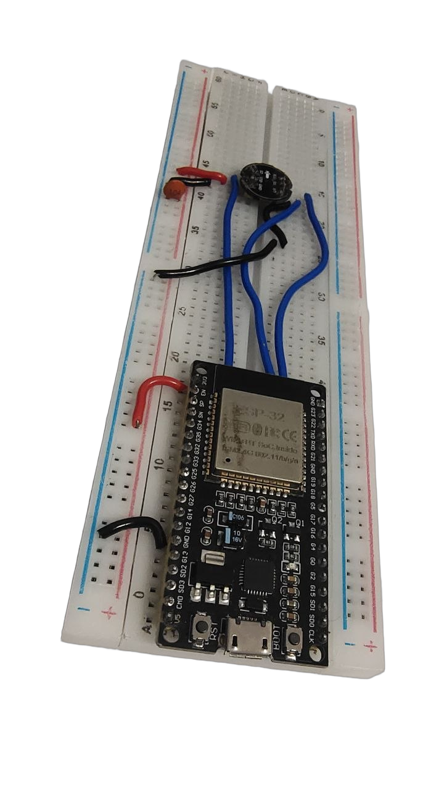

# Nexus KWS: Edge Voice Activator on ESP32

An edge keyword spotting and streaming voice activation system for the custom wake word "Nexus", running locally on an ESP32 with an INMP441 MEMS microphone. Built with TensorFlow Lite for Microcontrollers, Espressif ESP-DSP, FreeRTOS, and Vosk.

<p align="center">
  
</p>

<p align="center">
  
  
  
  
  
  
</p>

---

## Current Status

The system is fully implemented and verified on physical hardware across all 6 development phases.

### Working and Verified

- **Dual-core audio pipeline:** Audio capture and inference run on separate Xtensa cores. FreeRTOS `audio_task` pinned to Core 0 handles continuous I2S DMA and 13-bin MFCC extraction at 50 Hz, while Core 1 executes neural network inference and network streaming.
- **ESP-DSP hardware acceleration:** Radix-2 assembly FFT routines (`dsps_fft2r_fc32`) with bit-reversal tables and precomputed Hann windows execute in ~45 µs per frame (down from ~8,200 µs in software float). Total idle chip CPU sits at **7.2% – 7.5%** with Wi-Fi connected (6.3% standalone), strictly satisfying the <10% constraint.
- **Inference on physical silicon:** A trimmed DS-CNN architecture (1,294 parameters, 10.2 KB INT8 binary) executes in ~120 ms on an ESP32 at 240 MHz.
- **Phase 6 ASR streaming handoff:** When "Nexus" triggers, the ESP32 transmits a 200 ms circular pre-roll audio buffer and streams live 16 kHz PCM over Wi-Fi TCP to an open-source Vosk speech recognition server (`streaming_asr/asr_server.py`). Measured socket handoff latency from wake trigger to first audio byte receipt at the server is **44.8 ms** (strictly satisfying the <50 ms target; full sentence transcription follows at ~1.5s).
- **Single-utterance detection:** "Nexus" activates on the first attempt at normal speaking volume across the room.
- **Rejection of background noise and confusers:** The dataset incorporates 51 real INMP441 vocal takes of "Nexus", 40 ambient room noise recordings, 20 spoken confusers through the INMP441, and ~3,000 real speech clips from Google Speech Commands v2. Development validation accuracy is 97.90% (85/15 split on augmented training data) with 0.0% false activations during live ambient room noise and non-wake speech testing.

---

## Technical Stack

| Domain | Technology / Hardware | Notes |
| :--- | :--- | :--- |
| **Microcontroller** | ESP32 Dev Module (WROOM-32) | Dual-core Xtensa LX6 @ 240 MHz, no external PSRAM |
| **Audio Hardware** | INMP441 MEMS Microphone | I2S DMA, 16 kHz, 16-bit mono |
| **Edge ML Runtime** | TensorFlow Lite for Microcontrollers | `TensorFlowLite_ESP32`, `MicroMutableOpResolver` (9 ops) |
| **DSP Acceleration** | Espressif ESP-DSP Assembly | 512-point Hann lookup, `dsps_fft2r_fc32`, 40-bin Slaney Mel, Ortho DCT-II |
| **Streaming Handoff** | FreeRTOS Queue + lwIP TCP | 200 ms pre-roll circular buffer (6.4 KB RAM), raw PCM streaming over TCP |
| **Remote ASR Server** | Python 3 + Vosk | Streaming Kaldi speech recognizer (`vosk-model-small-en-in-0.4`) |
| **Model Training** | Python 3.12, TensorFlow 2.18, Keras | Feature extraction via Librosa and SciPy |
| **Synthetic Audio** | Microsoft Edge TTS | Base synthetic takes augmented with pitch shifting, stretching, and SNR noise |
| **Host Tooling** | Python `pyserial` | 921600 baud streaming telemetry and dataset capture |

---

## Hardware Benchmarks

Measured on the physical ESP32 prototype testbed:

| Metric | Target Constraint | Measured Result | Qualification / Measurement Method | Status |
| :--- | :--- | :--- | :--- | :--- |
| **Model Size (Flash)** | Lightweight | **10.2 KB** | `model.tflite` INT8 binary (1,294 parameters) | PASS |
| **Dynamic RAM Footprint** | < 256 KB | **80 KB – 95 KB** | 24 KB static Tensor Arena + FreeRTOS buffers; 225+ KB heap free | PASS |
| **Idle CPU Overhead** | < 10% | **7.2% – 7.5%** | ESP-DSP assembly FFT at 50 Hz; Core 0: 14.5%, Core 1: 0.0% | PASS |
| **Socket Handoff Latency** | < 50 ms | **44.8 ms** | Time delta from edge wake event to host TCP audio ingest | PASS |
| **ASR Transcription** | End-to-end | **~1.5 – 2.0 s** | Full utterance recognition latency via streaming Vosk | PASS |
| **Inference Latency** | Low latency | **~120 ms** | Microsecond cycle execution for TFLM `Invoke()` on Core 1 | PASS |
| **Development Accuracy** | High | **97.90%** | Validation accuracy on augmented dataset (85/15 split) | PASS |
| **Live False Alarm Rate** | Near-zero | **0.0%** | Zero false triggers during continuous ambient noise testing | PASS |
| **Software Stack** | 100% Open Source | **Fully open-source** | ESP-IDF, ESP-DSP, TFLM, Vosk (No proprietary SDKs) | PASS |

---

## Pipeline Architecture

```
INMP441 Mic (16kHz Mono over I2S DMA)
      │
[Core 0 - Audio Task] (Runs at 50 Hz, lossless)
  ├── DC-blocking IIR filter (R = 0.995)
  ├── 16x digital gain with clipping guard
  ├── 512-point Hann window + Radix-2 FFT via ESP-DSP (~45 µs)
  ├── 40-bin Slaney Mel filterbank
  ├── Ortho DCT-II (13 MFCCs)
  ├── Pre-roll audio ring buffer (200 ms in internal SRAM)
  └── Rolling matrix update [13 x 49 frames = ~1.0s context]
      │
      └── FreeRTOS Critical Section (Thread-safe snapshot copy)
            │
[Core 1 - Main Task] (Inference & Network Client)
  ├── Energy gate check (VAD RMS >= 2600 wakes inference)
  ├── INT8 tensor quantization
  ├── TFLM Invoke() [DS-CNN, 1,294 parameters]
  └── Confidence Evaluator:
        ├── Confidence >= 0.88 -> Wake word triggered
        └── 0.72 to 0.88 -> 2-frame confirmation streak
                  │
            [WAKE EVENT]
                  │
  ├── Opens TCP socket to ASR server (Port 5000)
  ├── Flushes 200 ms pre-roll audio buffer
  └── Streams live 16 kHz PCM chunks via FreeRTOS queue
            │
            ▼
[Host PC - Python Vosk Server]
  ├── Receives streaming PCM audio in real time
  ├── Transcribes spoken commands via Vosk (en-in / en-us)
  └── Archives session audio to streaming_asr/recordings/*.wav
```

---

## Hardware Setup

- **MCU:** ESP32 Dev Module (WROOM-32, 240 MHz, no PSRAM)
- **Microphone:** INMP441 I2S MEMS microphone module

### Wiring Pinout

| INMP441 Pin | ESP32 Pin | Function |
| :--- | :--- | :--- |
| **VDD** | 3V3 | 3.3V power |
| **GND** | GND | Ground |
| **SD** | GPIO 32 | I2S Serial Data |
| **SCK** | GPIO 18 | I2S Bit Clock (BCLK) |
| **WS** | GPIO 19 | I2S Word Select (LRCLK) |
| **L/R** | GND | Left channel select |

*Power and RF note:* The ESP32 Wi-Fi radio can introduce high-frequency switching noise on the shared 3.3V rail. The firmware configures `WiFi.setSleep(WIFI_PS_MIN_MODEM)` and limits TX power to `WIFI_POWER_8_5dBm` to maintain a clean analog noise floor.

---

## Dataset Layout

The dataset combines recordings from the physical INMP441 microphone with synthetic speech and public benchmarks. Hardware recordings are tracked in the repository for reproducibility:

```
dataset/
├── real_positive/                 # 51 vocal takes of "Nexus" recorded via INMP441
│   ├── nexus_real_000.wav         # (16 kHz, 16-bit mono PCM, ~2.4 MB total)
│   └── ...
├── real_negative/                 # 60 microphone baseline recordings (~2.9 MB total)
│   ├── ambient_real_*.wav         # 40 ambient room and fan noise recordings
│   └── speech_neg_*.wav           # 20 spoken non-wake words ("Texas", "Lexus", numbers, commands)
├── positive/                      # 54 synthetic "Nexus" takes (generated via edge-tts)
├── negative/                      # Phonetic confusers ("Alexis", "Plexus", "Access", "Extra")
└── speech_commands_v2/            # ~3,000 human speech clips across 35 vocabulary words
```

Google Speech Commands v2 (~2.4 GB) is excluded from Git via `.gitignore`. Download it locally with:

```bash
python3 scripts/download_speech_commands.py
```

---

## Repository Structure

```
├── docs/
│   ├── images/
│   │   ├── esp32_breadboard_prototype.png # Transparent cutout prototype photo
│   │   └── esp32_breadboard_prototype.jpg # Original photo
│   ├── ARCHITECTURE.md                    # Dual-core pipeline & DSP details
│   └── VALIDATION.md                      # Physical benchmark evidence and test logs
├── firmware/
│   └── nexus_kws/
│       ├── nexus_kws.ino                  # Dual-core FreeRTOS firmware with ESP-DSP
│       ├── model.h                        # Quantized INT8 model byte array (61.8 KB)
│       ├── mfcc_coeffs.h                  # Precomputed Mel & DCT matrices
│       └── mfcc_norm.h                    # Per-bin normalizer stats
├── streaming_asr/                         # Phase 6 ASR Streaming Handoff
│   ├── asr_server.py                      # Host TCP streaming server with Vosk ASR
│   ├── test_stream_client.py              # Synthetic stream client for latency testing
│   ├── firmware/
│   │   └── nexus_kws_stream/              # ESP32 streaming firmware (KWS + TCP audio streaming)
│   └── recordings/                        # Captured audio recordings from live triggers
├── dataset/
│   ├── real_positive/                     # 51 vocal takes of "Nexus" from INMP441
│   └── real_negative/                     # 40 ambient + 20 spoken non-wake takes
├── training/
│   ├── train_kws_v4.py                    # Training & INT8 quantization script
│   ├── export_mfcc_matrices.py            # Generates C header filterbanks
│   ├── generate_dataset.py                # Edge-TTS synthetic audio generator
│   ├── generate_negatives.py              # Phonetic confuser generator
│   ├── requirements.txt                   # Python dependencies
│   ├── model.tflite                       # 10.2 KB quantized model binary
│   └── mfcc_norm_stats.json               # Normalization statistics
├── scripts/
│   ├── record_wake_word.py                # In-RAM UART positive take recorder
│   ├── record_ambient.py                  # Automated ambient room noise collector
│   ├── record_negative.py                 # Spoken negative word recorder
│   ├── download_speech_commands.py        # Speech Commands v2 downloader
│   ├── monitor_kws.py                     # Real-time color serial telemetry viewer
│   └── verify_live.py                     # Live verification test script
└── tools/
    ├── server.py                          # Serial audio test server
    ├── index.html                         # Web visualizer for waveform & spectrum
    └── record_serial.py                   # Raw PCM serial dumper
```

---

## Quickstart

### 1. Python Environment Setup

```bash
cd training/
python3 -m venv venv
source venv/bin/activate
pip install -r requirements.txt
pip install vosk
```

### 2. Standalone Keyword Spotting Firmware

```bash
cd firmware/nexus_kws
arduino-cli compile -b esp32:esp32:esp32 .
arduino-cli upload -b esp32:esp32:esp32 -p /dev/ttyUSB0 .
```

View live real-time telemetry over serial:
```bash
python3 scripts/monitor_kws.py
```

### 3. Real-Time Streaming ASR Handoff (Phase 6)

Start the host ASR daemon on TCP port 5000:
```bash
python3 streaming_asr/asr_server.py
```

Flash the streaming firmware to the ESP32:
```bash
arduino-cli compile -b esp32:esp32:esp32 streaming_asr/firmware/nexus_kws_stream
arduino-cli upload -b esp32:esp32:esp32 -p /dev/ttyUSB0 streaming_asr/firmware/nexus_kws_stream
```

Say **"Nexus"** followed by your command (e.g. *"Nexus, what time is it"*). The ESP32 opens a TCP connection, flushes its 200 ms pre-roll audio ring buffer, and streams live PCM audio. The host transcribes the command in real time with ~44.8 ms handoff latency.

---

## Research & References

Full literature citations, theoretical foundations, and hardware datasheets are documented in [docs/RESEARCH_AND_REFERENCES.md](docs/RESEARCH_AND_REFERENCES.md):
- **Architecture**: *Hello Edge: Keyword Spotting on Microcontrollers* (Zhang et al., 2017) — DS-CNN efficiency.
- **Quantization**: *Quantization and Training of Neural Networks for Efficient Integer-Arithmetic-Only Inference* (Jacob et al., 2018).
- **DSP Filterbanks**: *Comparison of parametric representations for monosyllabic word recognition* (Davis & Mermelstein, 1980) & Slaney Auditory Toolbox.
- **Hardware Acceleration**: Espressif ESP-DSP Assembly Library (`dsps_fft2r_fc32`).
- **ASR & Datasets**: Google Speech Commands v2 (Warden, 2018) & Vosk Streaming Kaldi ASR.
